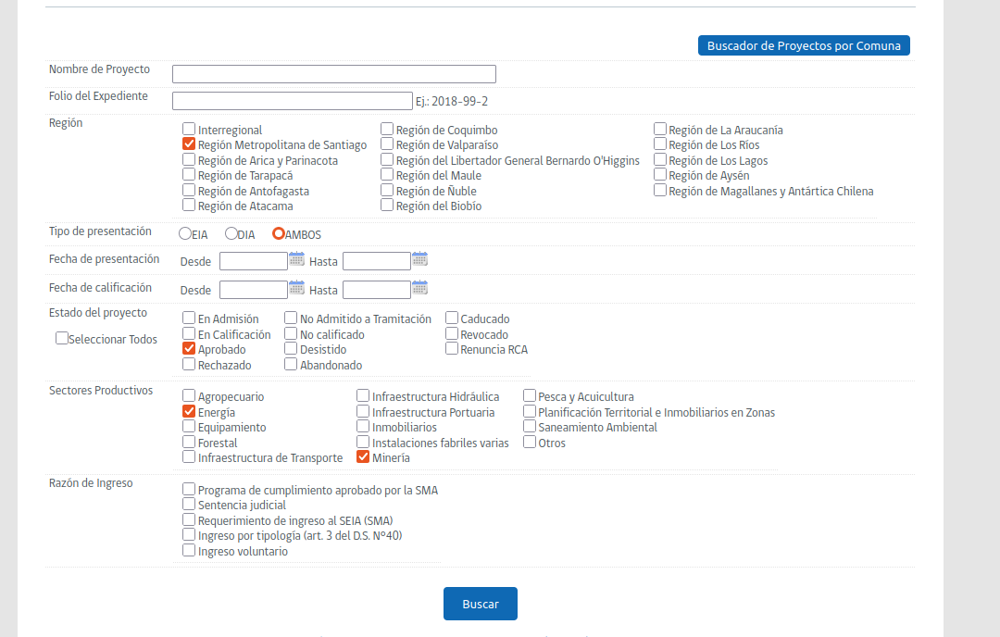
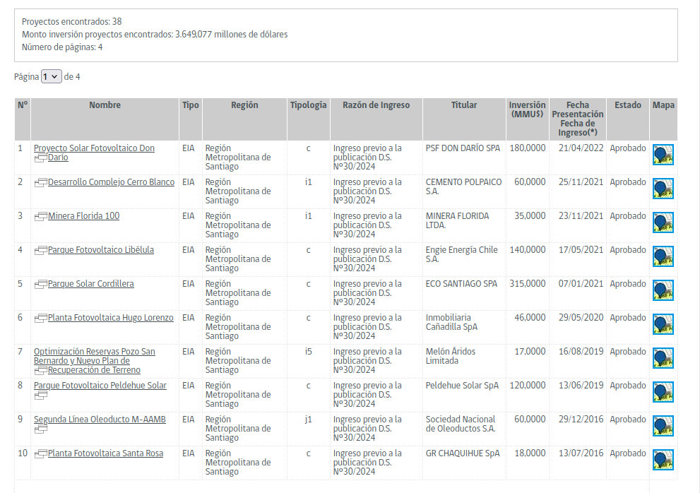
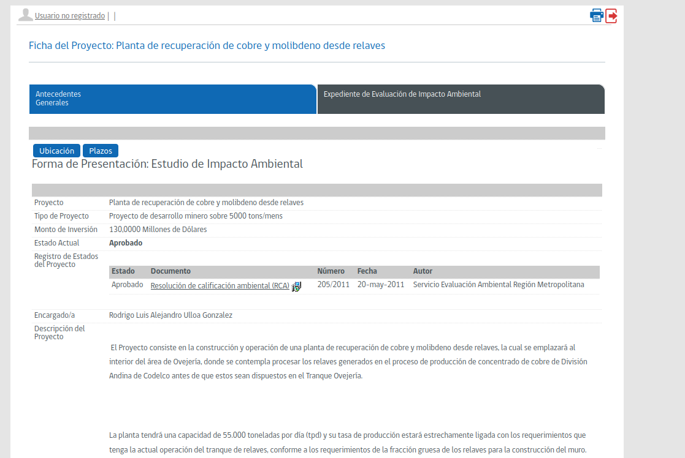
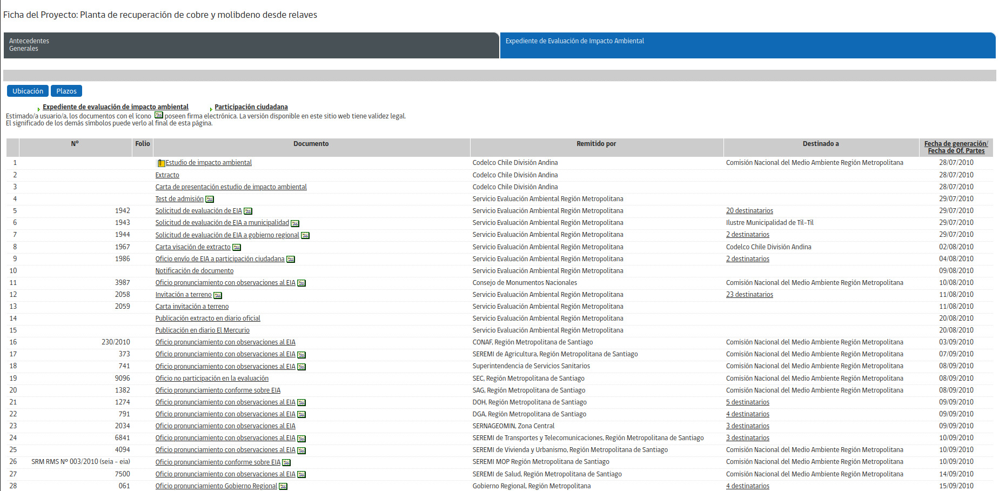
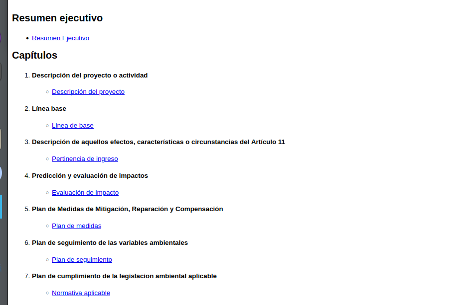
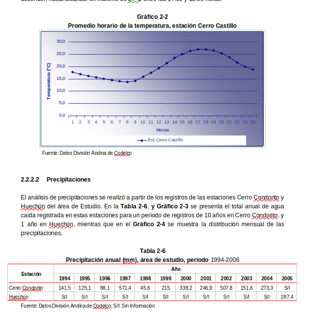
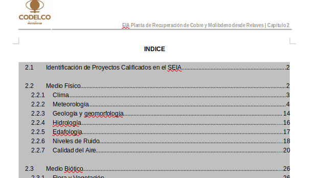

# Tutorial para Búsquedas sobre Calidad del Aire y Atmósfera en Santiago en el Sistema e-SEIA

## 1. Introducción al Sistema e-SEIA

El Sistema de Evaluación de Impacto Ambiental electrónico (e-SEIA) es la plataforma oficial del Servicio de Evaluación Ambiental (SEA) que permite acceder a la documentación completa de todos los proyectos sometidos a evaluación ambiental en Chile.

Para investigaciones relacionadas con calidad del aire en Santiago, esta plataforma es una valiosa fuente de información ya que contiene:
- Estudios de línea base atmosférica
- Modelaciones de dispersión de contaminantes
- Planes de seguimiento de emisiones
- Medidas de mitigación relacionadas con calidad del aire
- Datos de monitoreo atmosférico

## 2. Acceso al Sistema e-SEIA

1. Dirígete a [https://seia.sea.gob.cl](https://seia.sea.gob.cl)
2. No es necesario registrarse para realizar consultas básicas (aunque algunas funcionalidades avanzadas podrían requerir registro)

## 3. Opciones de Búsqueda en el e-SEIA

### 3.1 Búsqueda de Proyectos por Filtros Básicos

Como se observa en la siguiente imagen, el sistema ofrece diferentes filtros para encontrar proyectos:

1. En la página principal, haz clic en "Buscar Proyectos"
2. Configura los siguientes filtros para estudios relacionados con calidad del aire en Santiago:

   - **Región**: Selecciona "Región Metropolitana de Santiago"
   - **Tipo de presentación**: Puedes seleccionar "EIA" (Estudios de Impacto Ambiental), "DIA" (Declaración de Impacto Ambiental) o "AMBOS" dependiendo de tu interés
   - **Estado del proyecto**: "Aprobado" es recomendable para ver proyectos con mediciones y evaluaciones validadas
   - **Sectores Productivos**: Selecciona los sectores más relevantes para calidad del aire:
     - "Energía" (centrales termoeléctricas, proyectos de combustión)
     - "Minería" (fundiciones, procesamiento de minerales)
     - "Instalaciones fabriles varias"
   
3. Haz clic en "Buscar"

### 3.2 Búsqueda Avanzada por Palabras Clave

Para búsquedas más específicas relacionadas con calidad del aire:

1. En el campo "Nombre de Proyecto" puedes ingresar términos como:
   - "Calidad aire"
   - "Emisiones atmosféricas"
   - "Material particulado"
   - "MP10" o "MP2.5"
   - "NOx" o "SO2"
   - "Monitoreo atmosférico"

2. También puedes ingresar comunas específicas de Santiago donde se concentran problemas de calidad del aire:
   - "Pudahuel"
   - "Cerrillos"
   - "La Florida"
   - "Las Condes"
   - "Independencia"

## 4. Navegación por los Resultados de Búsqueda

Los resultados se presentan en forma de tabla con la siguiente información:

- Nombre del proyecto
- Tipo (EIA o DIA)
- Región
- Tipología
- Razón de ingreso
- Titular
- Inversión
- Fecha
- Estado
- Mapa (acceso a ubicación)

Para cada proyecto encontrado:

1. Haz clic en el nombre del proyecto para acceder a su ficha completa
2. Podrás ver el "Estado Actual" del proyecto (Aprobado, Rechazado, En Calificación, etc.)
3. Revisa la "Tipología" y "Descripción del Proyecto" para determinar si es relevante para tu investigación sobre calidad del aire

## 5. Revisión de la Ficha del Proyecto

La ficha de un proyecto contiene:

1. Antecedentes Generales
2. Expediente de Evaluación de Impacto Ambiental

En la sección "Expediente de Evaluación", encontrarás todos los documentos asociados al proyecto, incluyendo:

- Estudio de Impacto Ambiental (EIA) o Declaración de Impacto Ambiental (DIA)
- Anexos técnicos (donde suelen estar los estudios de calidad del aire)
- Adendas (respuestas a observaciones)
- Resolución de Calificación Ambiental (RCA)
- Oficios de pronunciamiento de organismos con competencia ambiental

## 6. Acceso a Documentos Específicos sobre Calidad del Aire

Una vez dentro del EIA o DIA, verás la estructura de capítulos como se muestra a continuación:

Para información sobre calidad del aire, enfócate en:

1. **Línea Base** (capítulo 2)
   - Esta sección contiene la caracterización del componente aire
   - Incluye datos de estaciones de monitoreo
   - Presenta las concentraciones basales de contaminantes
   - Describe las condiciones meteorológicas de la zona

2. **Descripción de efectos, características o circunstancias del Artículo 11** (capítulo 3)
   - Verifica si el proyecto genera efectos adversos sobre la calidad del aire

3. **Predicción y evaluación de impactos** (capítulo 4)
   - Revisa las modelaciones de dispersión atmosférica
   - Analiza los impactos proyectados sobre la calidad del aire

4. **Plan de Medidas de Mitigación, Reparación y Compensación** (capítulo 5)
   - Identifica medidas específicas para reducir emisiones atmosféricas

5. **Plan de seguimiento de las variables ambientales** (capítulo 6)
   - Revisa los programas de monitoreo de emisiones y calidad del aire
   - Verifica la ubicación de estaciones de monitoreo propuestas

## 7. Análisis de Información sobre Calidad del Aire

Al revisar un proyecto específico, como el que se muestra a continuación, debes enfocarte en:

### 7.1 Revisión de datos meteorológicos y calidad del aire

Dentro de la sección de "Línea Base" de un EIA, encontrarás datos meteorológicos que son fundamentales para entender la dispersión de contaminantes. A continuación se muestra un ejemplo del tipo de información que podrás encontrar:

La información meteorológica como temperatura, precipitaciones, vientos y estabilidad atmosférica es crucial para entender el comportamiento de los contaminantes en la atmósfera y validar las modelaciones de dispersión.

### 7.2 Estructura del capítulo de línea base

Cada EIA incluye un índice detallado de los componentes ambientales estudiados. Para investigaciones sobre calidad del aire, debes prestar especial atención a las secciones de meteorología y calidad del aire, como se muestra en este ejemplo:

En este ejemplo, puedes observar que la información sobre calidad del aire se encuentra en la sección 2.2.7, mientras que los datos meteorológicos relevantes para entender la dispersión de contaminantes están en la sección 2.2.2. Estos datos son esenciales para:

### 7.3 Aspectos clave a analizar

Al revisar estas secciones, debes enfocarte en los siguientes aspectos:

1. **Emisiones atmosféricas**:
   - Fuentes de emisión identificadas
   - Tipos de contaminantes emitidos
   - Tasas de emisión estimadas

2. **Modelaciones de dispersión**:
   - Software utilizado (AERMOD, CALPUFF, etc.)
   - Datos meteorológicos de entrada
   - Resultados de concentraciones modeladas

3. **Datos de línea base**:
   - Estaciones de monitoreo utilizadas
   - Series de tiempo de concentraciones
   - Comparación con normas de calidad del aire

4. **Medidas de control**:
   - Tecnologías de abatimiento propuestas
   - Eficiencias esperadas
   - Compromisos de reducción de emisiones

## 8. Descarga y Almacenamiento de Documentación

Para los documentos relevantes:

1. Busca el ícono de descarga junto a cada documento
2. Los archivos suelen estar en formato PDF
3. Para estudios extensos, es recomendable descargar capítulos específicos
4. Organiza la información descargada por:
   - Tipo de proyecto
   - Ubicación dentro de Santiago
   - Contaminantes de interés

## 9. Búsqueda Específica para Diferentes Tipos de Contaminantes

### 9.1 Material Particulado (MP10 y MP2.5)
- Utiliza palabras clave: "material particulado", "MP10", "MP2.5", "polvo en suspensión"
- Busca proyectos de construcción, minería y combustión

### 9.2 Gases (NOx, SO2, CO)
- Utiliza términos como: "óxidos de nitrógeno", "dióxido de azufre", "monóxido de carbono"
- Enfócate en proyectos energéticos y de transporte

### 9.3 Compuestos Orgánicos Volátiles (COVs)
- Busca términos como: "COVs", "compuestos orgánicos volátiles", "emisiones evaporativas"
- Revisa proyectos industriales, químicos y de hidrocarburos

## 10. Interpretación de Resultados para la Cuenca de Santiago

Es importante contextualizar la información obtenida considerando:

1. **Condiciones topográficas de Santiago**:
   - La cuenca está rodeada de montañas que limitan la dispersión
   - Fenómenos de inversión térmica son frecuentes

2. **Condiciones meteorológicas**:
   - Estaciones del año (invierno crítico para material particulado)
   - Patrones de viento dominantes

3. **Zonas críticas**:
   - Identifica áreas con mayor concentración de emisiones
   - Considera zonas latentes o saturadas

## 11. Ejemplo Práctico de Búsqueda

Supongamos que queremos investigar el impacto en la calidad del aire de una planta industrial en Santiago:

1. Selecciona "Región Metropolitana de Santiago"
2. Marca "Instalaciones fabriles varias" en Sectores Productivos
3. Selecciona "Aprobado" en Estado del proyecto
4. En Nombre de Proyecto, ingresa "emisiones" o "calidad aire"
5. Haz clic en "Buscar"
6. En los resultados, identifica proyectos en comunas de interés
7. Accede a la ficha del proyecto y luego a su EIA o DIA
8. Revisa específicamente la Línea Base y Predicción de Impactos
9. Descarga los anexos técnicos relacionados con modelaciones atmosféricas
10. Analiza los resultados considerando otras fuentes existentes en la zona

## 12. Recursos Complementarios

Para complementar la información del e-SEIA, te recomendamos:

1. **Sistema de Información Nacional de Calidad del Aire (SINCA)**:
   - Proporciona datos de estaciones de monitoreo oficiales
   - [https://sinca.mma.gob.cl/](https://sinca.mma.gob.cl/)

2. **Inventario de Emisiones de la Región Metropolitana**:
   - Disponible en la página web del Ministerio del Medio Ambiente

3. **Guías Metodológicas del SEA**:
   - "Guía para la Descripción de la Calidad del Aire en el Área de Influencia de Proyectos"
   - "Guía para el Uso de Modelos de Calidad del Aire en el SEIA"

## 13. Buenas Prácticas y Recomendaciones Finales

1. **Optimiza tus búsquedas**:
   - Comienza con filtros amplios y luego reduce gradualmente
   - Utiliza terminología técnica precisa
   - Combina diferentes criterios de búsqueda

2. **Organiza la información**:
   - Crea una base de datos personal con los proyectos relevantes
   - Registra fechas, coordenadas y parámetros clave
   - Compara datos entre proyectos similares

3. **Análisis crítico**:
   - Verifica la metodología utilizada en las mediciones
   - Compara con estándares nacionales e internacionales
   - Considera la representatividad espacial y temporal de los datos

4. **Seguimiento temporal**:
   - Revisa informes de seguimiento para conocer la evolución real
   - Verifica cumplimiento de compromisos ambientales
   - Contrasta predicciones con datos reales de monitoreo

---

Este tutorial te permitirá aprovechar al máximo la información sobre calidad del aire y atmósfera en Santiago disponible en el sistema e-SEIA, facilitando investigaciones, análisis y toma de decisiones basadas en datos ambientales oficiales.
